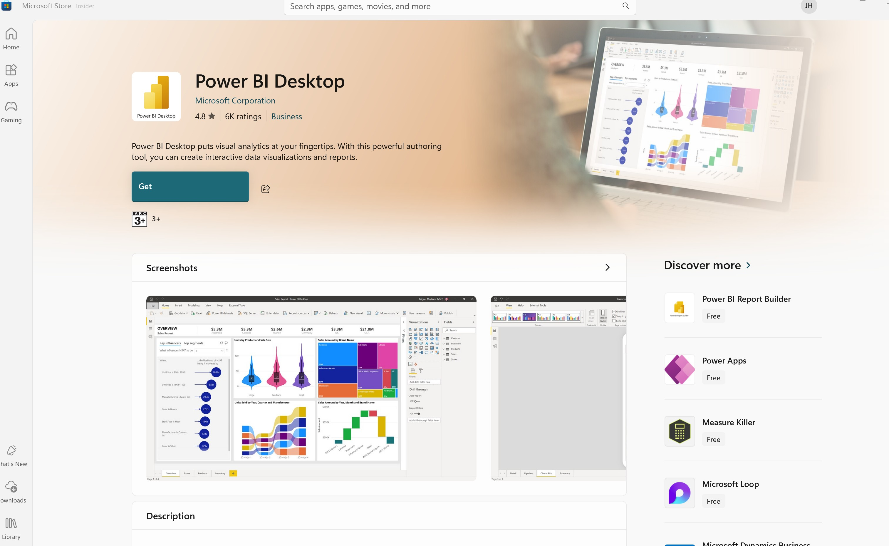

# **PowerBI-AdventureWorks-Sales-Analysis**
 Description:- This repo will contain the sales analysis dashboard for the adventure works fictional company's sales data

## **Background**

In this project I used SQL and Power BI to made a Sales Management project for AdventureWorks.\
This is a free publicly available database for a fictional bike company created by Microsoft.\
The data set was imported from AdventureWorksDW2019 on SQL Server sample database.

## **Source Data & Pre-Requisites:**
 Connected to a SQL Server Adventure Works DW 2019 Database which is downloaded from Microsoft website: Link below:
 You need to install SQL Server Management Studio and SQL Server 2019 Atleast on your laptop / PC device

**Step-1: Download the sample Database** 

 Download the Sample AdventureworksDW2019 database used in the project from the microsoft page:
 \
 https://github.com/Microsoft/sql-server-samples/releases/download/adventureworks/AdventureWorksDW2019.bak 

**Step-2: Restore the Datbase File (.bak file) from your downloaded path**

 

Once you restore the database, you can connect to it using SQL Server Management Studio (SSMS) and run queries to extract the data you need for your Power BI reports.

**Step-3: Creating a new database for PowerBI Reporting Purposes and Create views with the following SQL scripts**

Connect to the SQL_Server Instance in SSMS and run the following SQL scripts to create a new database and views for Power BI reporting purposes:

Execute the following SQL script to create a new database named "PowerBI_Reporting using the script "SQL\1_Database_Schema_Creation.sql"

Execute the below SQL scripts to create views in PowerBI_Reporting Database using the scripts:\

 

 Once the scripts are executed successfully, you will have the following views created in the PowerBI_Reporting database:

To create the necessary data model for doing analysis and fulfilling the business needs defined the above views were extracted using SQL in

## **Power BI Dashboard:**

Download and Launch Power BI Desktop from the Microsoft Store or the official website.\
https://www.microsoft.com/en-us/download/details.aspx?id=58494

Or 
You can also download the Power BI Desktop from the Microsoft Store on Windows 10 or later.

Once you have Power BI Desktop installed, you can connect to the SQL Server database and import the data from the views we created earlier.

